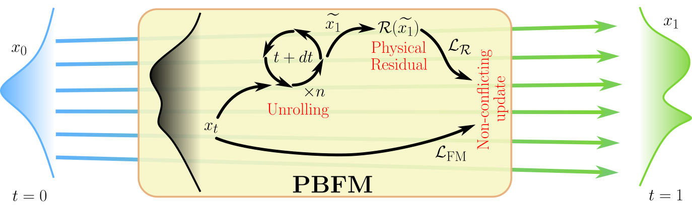

# Official implementation of PBFM — Physics-Based Flow Matching

<div align="center">
    
[Paper](https://arxiv.org/abs/2506.08604) • [Datasets🤗](https://huggingface.co/datasets/thuerey-group/PBFM)
</div>


**Authors:** [Giacomo Baldan](https://baldang.github.io), [Qiang Liu](https://qiauil.github.io/), [Alberto Guardone](https://www.aero.polimi.it/en/staff/alberto.guardone), [Nils Thuerey](https://ge.in.tum.de/about/n-thuerey/)

---
<div align="center">

</div>

## Installation
Install the required Python packages using pip:
```
pip install torch h5py torchfsm conflictfree einops timm findiff rotary_embedding_torch
```

## Training
Training requires at least one GPU and uses PyTorch's Distributed Data Parallel (DDP). To train the model on a single GPU, run:

```
torchrun --nnodes=1 --nproc_per_node=1 train_ddp.py
```

## Reproducing sampling results
Pretrained model checkpoints for each test case are available in the `logs/PBFM` folder. To generate samples using the pretrained PBFM model, run:

```
python sample.py --version PBFM
```

## Test cases
See the [reference paper](https://arxiv.org/abs/2506.08604) for more details:
- Darcy flow
- Kolmogorov flow
- Dynamic stall

Kolmogorov flow and dynamic stall datasets are available from [Hugging Face](https://huggingface.co/datasets/thuerey-group/PBFM). For the Darcy flow dataset, see [PIDM](https://doi.org/10.3929/ethz-b-000674074).

```
PBFM
├── darcy_flow
│   ├── train
│   │   ├── K_data.csv
│   │   └── p_data.csv
│   └── valid
│       ├── K_data.csv
│       └── p_data.csv
├── dynamic_stall
│   ├── dynamic_stall_test.h5
│   └── dynamic_stall_train.h5
└── kolmogorov_flow
    ├── kolmogorov_test.h5
    └── kolmogorov_train.h5
```
